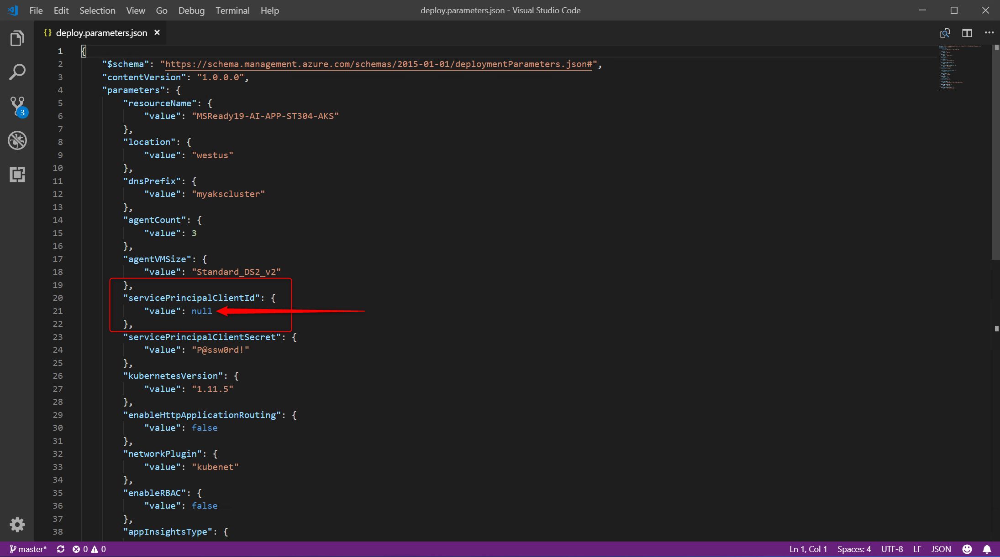
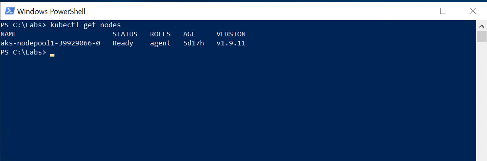

# Lab prerequisites

## 1. Clone the AI-APP-ST304 Lab Git repo

1. Start a command prompt session
2. Change directory to the Lab working folder by executing

   ```dos
   cd c:\Labs
   ```

3. Clone the official lab Git repo by executing  

   ```dos
   git clone https://github.com/MikeCer/MSReady19-AI-APP-ST304.git
   ```

## 2. Create a resource group

1. Start a command prompt session
2. Sign-In interactively trough your browser with the _az login_ command; after signing in, CLI commands are run against your default subscription
    1. Run the _login_ command  
         ```azurecli-interactive
        az login
        ```
        If the CLI can open your default browser, it will do so and load a sign-in page.
        Otherwise, you need to open a browser page and follow the instructions on the command line to enter an authorization code after navigating to https://aka.ms/devicelogin in your browser.
    2. Sign in with your account lab (cloud slice) credentials in the browser
    3. Verify that the authenticated session has been correctly established checking the JSON structure returned that needs to contain your subscriptions information  
        ``` json
        [
            {
                "cloudName": "AzureCloud",
                "id": "cf1526b4-c3e0-4ce8-8782-686db66a4347",
                "isDefault": true,
                "name": "MySubscription",
                "state": "Enabled",
                "tenantId": "675e22fe-b1b0-4b37-86c3-b491ab7a1431",
                "user": {
                    "name": "username@contoso.com",
                    "type": "user"
                }
            }
        ]
        ```
        Same output can be obtained by executing the command

         ```azurecli-interactive
        az account list
        ```

3. Create the resource group by executing the command  
    ```azurecli-interactive
    az group create -l westus -n MSReady19-Lab-RG
    ```
    that will create a new RG named MSReady19-Lab-RG using West US region in your default subscription.  
    The command will return a JSON structure like the following, indicating that the new RG has been successfully created.
    ``` json
    {
        "id": "/subscriptions/cf1526b4-c3e0-4ce8-8782-686db66a4347/resourceGroups/MSReady19-Lab-RG",
        "location": "westus",
        "managedBy": null,
        "name": "MSReady19-Lab-RG",
        "properties": {
            "provisioningState": "Succeeded"
        },
        "tags": null
    }
    ```

## 2. Create the Application Insights resource

1. Create the resource using the Azure CLI _resource create_ command

    ```azurecli-interactive
    az resource create --resource-group "MSReady19-Lab-RG" --resource-type "Microsoft.Insights/components" --name "MSReady19-AI-APP-ST304-AppInsights" --location "westus2" --properties "{\"ApplicationId\":\"MSReady19-AI-APP-ST304-AppInsights\",\"Application_Type\":\"other\",\"Flow_Type\":\"Redfield\",\"Request_Source\":\"IbizaAIExtension\"}"
    ```

    after the execution completion, the output will show a JSON object similar to this

    ```json
    {
        "etag": "\"9400df73-0000-0000-0000-5c278ebb0000\"",
        "id": "/subscriptions/adef826a-7ef0-4705-b52c-708e062c03d1/resourceGroups/MSReady19-Lab-RG/providers/microsoft.insights/components/MSReady19-AI-APP-ST304-AppInsights",
        "identity": null,
        "kind": "other",
        "location": "westus2",
        "managedBy": null,
        "name": "MSReady19-AI-APP-ST304-AppInsights",
        "plan": null,
        "properties": {
            "AppId": "9f581c23-307b-48a4-a44c-2505cb620f8d",
            "ApplicationId": "MSReady19-AI-APP-ST304-AppInsights",
            "Application_Type": "other",
            "CreationDate": "2018-12-29T15:11:54.4734986+00:00",
            "CustomMetricsOptedInType": null,
            "Flow_Type": "Redfield",
            "HockeyAppId": null,
            "HockeyAppToken": null,
            "InstrumentationKey": "59afe611-5e70-484a-b72e-856883393ed7", //<- take note of this value
            "Name": "MSReady19-AI-APP-ST304-AppInsights",
            "PackageId": null,
            "Request_Source": "IbizaAIExtension",
            "SamplingPercentage": null,
            "TenantId": "adef826a-7ef0-4705-b52c-708e062c03d1",
            "Ver": "v2",
            "provisioningState": "Succeeded"
        },
        "resourceGroup": "MSReady19-Lab-RG",
        "sku": null,
        "tags": {},
        "type": "microsoft.insights/components"
    }
    ```

    where the value of the property _provisioningState_ indicates that the AppInsights workspace has been successfully provisioned.

## 3. Create the Azure Kubernetes Service Lab cluster

The AKS cluster and all the related resources will be deployed directly using the Azure CLI.

1. Execute the following command

    ```azurecli-interactive
    az aks create -g "MSReady19-Lab-RG" -n "MSReady19-AI-APP-ST304-AKS" --node-count 1 --generate-ssh-keys --verbose
    ```

    that will automatically submit a deployment job in order to spin-up the AKS resource within the group previously created and then create the reserved resource group for all the components belonging to the managed Kubernetes infrastructure.

    After the execution completion, the output will show a JSON object similar to this:

    ```json
    {
        "aadProfile": null,
        "addonProfiles": null,
        "agentPoolProfiles": [
            {
            "count": 1,
            "maxPods": 110,
            "name": "nodepool1",
            "osDiskSizeGb": 30,
            "osType": "Linux",
            "storageProfile": "ManagedDisks",
            "vmSize": "Standard_DS2_v2",
            "vnetSubnetId": null
            }
        ],
        "dnsPrefix": "MSReady19--MSReady19-Lab-RG-adef82",
        "enableRbac": true,
        "fqdn": "msready19--msready19-lab-rg-adef82-2a5df105.hcp.westus.azmk8s.io",
        "id": "/subscriptions/adef826a-7ef0-4705-b52c-708e062c03d1/resourcegroups/MSReady19-Lab-RG/providers/Microsoft.ContainerService/managedClusters/MSReady19-AI-APP-ST304-AKS",
        "kubernetesVersion": "1.9.11",
        "linuxProfile": {
            "adminUsername": "azureuser",
            "ssh": {
            "publicKeys": [
                {
                "keyData": "ssh-rsa AAAAB3NzaC1yc2EAAAADAQABAAABAQC4KvfsVSzGeT779+4wv2jPHt07FYRt9I+M9kXDPfbCvDgVgA3B1lcssJioJ8oCrpYX9gZACCyNl9RgI9jTbqn+JZ0bepfzurer84Fa/dFHOR6pdGJtgya7qQpLyl+sCxPEFm2v2v8KBuWRKB9N9GsTyvOQOZoSIIxkA29vtDMbSJ1UBh1g/H7Zv7w54hhxMdEFTEL2q6ht7pvx8Ppd9Heda7P8HYWDB1z8pB3WgRHIN9jZ3bHezqLHJ9oDq/FCj80ZMEvoWEDJivoLFRHhKFi1q66yQ3Ri2YNOYSQcE76NGB/v7JmmiB0h9i7lrW/jg13kgfVPO0XfE22CbwMrpM6f"
                }
            ]
            }
        },
        "location": "westus",
        "name": "MSReady19-AI-APP-ST304-AKS",
        "networkProfile": {
            "dnsServiceIp": "10.0.0.10",
            "dockerBridgeCidr": "172.17.0.1/16",
            "networkPlugin": "kubenet",
            "networkPolicy": null,
            "podCidr": "10.244.0.0/16",
            "serviceCidr": "10.0.0.0/16"
        },
        "nodeResourceGroup": "MC_MSReady19-Lab-RG_MSReady19-AI-APP-ST304-AKS_westus",
        "provisioningState": "Succeeded",
        "resourceGroup": "MSReady19-Lab-RG",
        "servicePrincipalProfile": {
            "clientId": "6a948472-5d33-4826-95e4-1e66f0d40bca",
            "secret": null
        },
        "tags": null,
        "type": "Microsoft.ContainerService/ManagedClusters"
    }
    ```

    that reports a bunch of useful information like the _fqdn_ value of the cluster, the network profile, the size and the OS profile of the VMs which are composing the cluster.

2. In order to verify that your AKS is up & running, you need to use _kubectl_ tool, but first you have to get the credentials for your cluster by running the following command:

    ```dos
    az aks get-credentials --resource-group MSReady19-Lab-RG --name MSReady19-AI-APP-ST304-AKS
    ```

    Azure CLI will merge the references of the newly created AKS cluster with the local _kubectl_ configuration  

    

3. Get the nodes list using  _kubectl_ by executing the following command

    ```dos
    kubectl get nodes 
    ```

    that will show that our single-node AKS cluster is successfully running

    