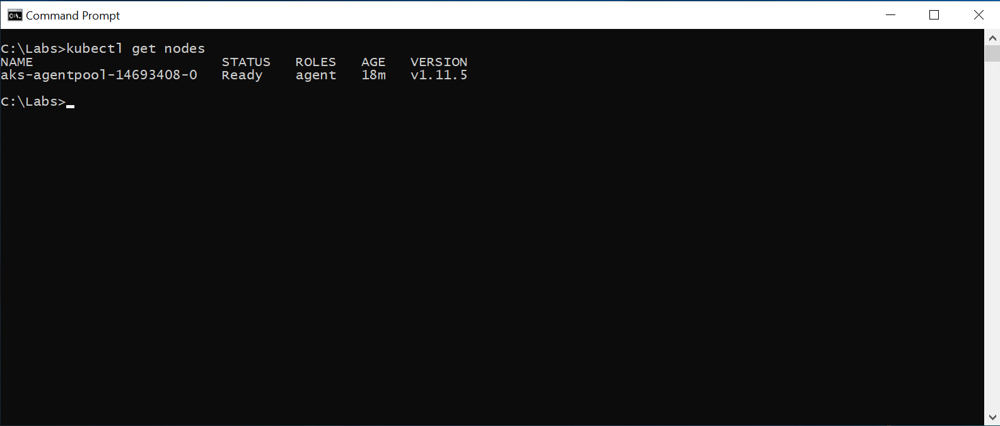

# Lab prerequisites

## 1. Clone the AI-APP-ST304 Lab Git repo

1. Start a command prompt session
2. Change directory to the Lab working folder by executing

   ```dos
   cd c:\Labs
   ```

3. Clone the official lab Git repo by executing  

   ```dos
   git clone https://github.com/MikeCer/MSReady19-AI-APP-ST304.git
   ```

## 2. Create a resource group

1. Start a command prompt session
2. Sign-In interactively trough your browser with the _az login_ command; after signing in, CLI commands are run against your default subscription
    1. Run the _login_ command  
         ```azurecli-interactive
        az login
        ```
        If the CLI can open your default browser, it will do so and load a sign-in page.
        Otherwise, you need to open a browser page and follow the instructions on the command line to enter an authorization code after navigating to https://aka.ms/devicelogin in your browser.
    2. Sign in with your account lab (cloud slice) credentials in the browser
    3. Verify that the authenticated session has been correctly established checking the JSON structure returned that needs to contain your subscriptions information  
        ``` json
        [
            {
                "cloudName": "AzureCloud",
                "id": "cf1526b4-c3e0-4ce8-8782-686db66a4347",
                "isDefault": true,
                "name": "MySubscription",
                "state": "Enabled",
                "tenantId": "675e22fe-b1b0-4b37-86c3-b491ab7a1431",
                "user": {
                    "name": "username@contoso.com",
                    "type": "user"
                }
            }
        ]
        ```
        Same output can be obtained by executing the command

         ```azurecli-interactive
        az account list
        ```

3. Create the resource group by executing the command  
    ```azurecli-interactive
    az group create -l westus -n MSReady19-Lab-RG
    ```
    that will create a new RG named MSReady19-Lab-RG using West US region in your default subscription.  
    The command will return a JSON structure like the following, indicating that the new RG has been successfully created.
    ``` json
    {
        "id": "/subscriptions/cf1526b4-c3e0-4ce8-8782-686db66a4347/resourceGroups/MSReady19-Lab-RG",
        "location": "westus",
        "managedBy": null,
        "name": "MSReady19-Lab-RG",
        "properties": {
            "provisioningState": "Succeeded"
        },
        "tags": null
    }
    ```

## 3. Create a Service Principal

To interact with Azure APIs, an AKS cluster requires an Azure Active Directory (AD) service principal. The service principal is needed to dynamically create and manage other Azure resources such as an Azure load balancer or container registry (ACR).

To create an Azure AD service principal, you must have permissions to register an application with your Azure AD tenant, and to assign the application to a role in your subscription.

1. Execute the following command  

   ```azurecli-interactive
    az ad sp create-for-rbac --name "MyAKSLab-SP" --password "P@ssw0rd!"
    ```

    that will create a new service principal named _MyAKSLab-SP_ using the string _P@ssw0rd!_ as client secret.  
    The command output will be a JSON structure similar to this one

    ```json
    {
        "appId": "41b5d3e3-d597-4f73-a6d7-99b4d94abe0e", //sample GUID value
        "displayName": "MyAKSLab-SP",
        "name": "http://MyAKSLab-SP",
        "password": "P@ssw0rd!",
        "tenant": "72f988bf-86f1-41af-91ab-2d7cd011db47"
    }
    ```

    that recap the essential info of the newly created Service Principal

2. Take note of the property value _appId_ that needs to be included in the ARM deploy parameters file in the next step.

## 4. Create the Azure Kubernetes Service Lab cluster

The AKS cluster and the Application Insight Azure resources will be deployed using an ARM template trought Azure CLI.

1. Open the _deploy.parameters.json_ file in VS Code, by executing in the prompt the following command

    ```dos
    code "C:\Labs\Azure ARM deploy\deploy.parameters.json"
    ```

2. Replace the _null_ value of the _servicePrincipalClientId_ property with your final GUID obtained after the Service Principal creation step  

   

   in order to have the property defined similar to this one

    ```json
    "servicePrincipalClientId": {
            "value": "41b5d3e3-d597-4f73-a6d7-99b4d94abe0e" //sample GUID value
    }
    ```

3. Save the _deploy.parameters.json_ file using Ctrl+S shortcut or File->Save menu item click

4. Execute the Azure CLI group deployment command

    ```azurecli-interactive
    az group deployment create --name "LabTestDeploy" --resource-group "MSReady19-Lab-RG" --template-file "C:\Labs\Azure ARM deploy\deploy.json" --parameters @"C:\Labs\Azure ARM deploy\deploy.parameters.json"
    ```

5. The command prompt shows the string _- Running .._ until the deployment is completed, then the _az group deployment_ will return a JSON object with the whole definition of the just created resources.  

    

    Take note of the _myAppInsightsInstrumentationKey_ value reported in the _output_ property object that will be useful in the next lab module execution where Application Insights will be used to monitor our application metrics  

    ```json
    "outputs": {
                "controlPlaneFQDN": {
                    "type": "String",
                    "value": "myakscluster-b2bde326.hcp.westus.azmk8s.io"
                },
                "myAppInsightsInstrumentationKey": {
                    "type": "String",
                    "value": "3c82b5d7-6a69-4026-aaa0-3ca666addcaa"
                }
        }
    ```

6. In order to verify that your AKS is up & running, you need to use _kubectl_ tool, but first you have to get the credentials for your cluster by running the following command:

    ```dos
    az aks get-credentials --resource-group MSReady19-Lab-RG --name MSReady19-AI-APP-ST304-AKS
    ```

    Azure CLI will merge the references of the newly created AKS cluster with the local _kubectl_ configuration  

    

7. Get the nodes list using  _kubectl_ by executing the following command

    ```dos
    kubectl get nodes 
    ```

    that will show that our single-node AKS cluster is successfully running

    
