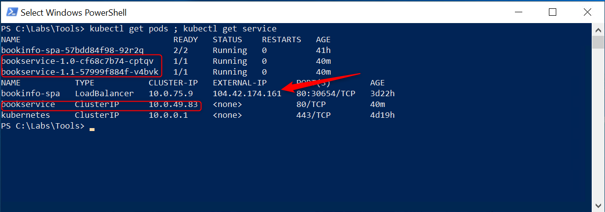
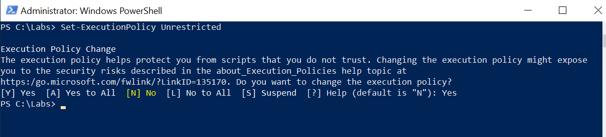
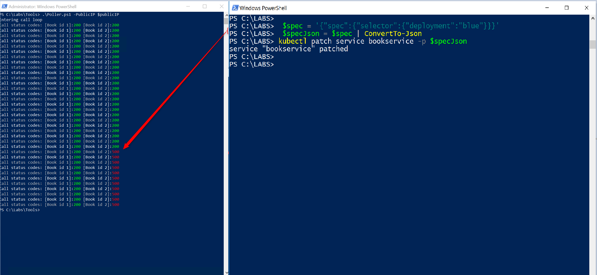

# Blue/Green Deployments

## 1. Clean-up existing BookService deployment

1. Using the PowerShell session, remove existing _bookservice_ deployment and service with _kubectl_ by executing the following commands:

    ```dos
    kubectl delete deployment bookservice ; kubectl delete service bookservice
    ```

    that will return

    ```plain
    deployment.extensions "bookservice" deleted
    service "bookservice" deleted
    ```

2. Wait few seconds and then double check the results of the delete operation by executing:

    ```dos
    kubectl get pod; kubectl get service
    ```

    that confirm the lack of references to the _bookservice_ pods and service

    ```plain
    NAME                            READY   STATUS    RESTARTS   AGE
    bookinfo-spa-57bdd84f98-92r2q   2/2     Running   0          39m
    NAME           TYPE           CLUSTER-IP   EXTERNAL-IP      PORT(S)        AGE
    bookinfo-spa   LoadBalancer   10.0.75.9    104.42.174.161   80:30654/TCP   2d5h
    kubernetes     ClusterIP      10.0.0.1     <none>           443/TCP        3d2h
    ```

## 2. Deploy the BookService (Blue \ Green) and set the Live Environment to Green

1. Execute the following command

   ```dos
    kubectl apply -f C:\Labs\k8sconfigurations\blue-green\bookservice-green-ok.yaml
   ```

   that will return

   ```plain
    deployment.apps/bookservice-1.0 created
    deployment.apps/bookservice-1.1 created
    service/bookservice created
   ```

2. Double check the results of the _apply_ operation by executing:

     ```dos
    kubectl get pod ; kubectl get service
    ```

    that confirms the creation of the k8s service and the two k8s pods _bookservice-1.0_ (our production environment - green) and _bookservice-1.1_ (our staging enviroment - blue)

      

3. Take note of the External-IP reported in the output, it will be used in the next step

## 3. Generate HTTP requests vs the BookService API

At this point we need to generate some HTTP traffic versus the BookService API using the _poller.ps1_ PowerShell script; this will highlight the effects of the blue \ green deployment strategy once we proceed to execute the swap between green and blue version.

1. Start a new PowerShell as admin and execute the following command to allow the execution of the _poller.ps1_ script

    ```powershell
    Set-ExecutionPolicy Unrestricted
    ```

    as the following screenshot

    

2. Type "Yes" and then hit _Enter_ to confirm the operation

3. Set the PowerShell $publicIP variable to the external IP reported by _kubectl_ in the previous step by executing, in that case:

    ```powershell
    $publicIP = "<external-ip-of-bookinfospa-service>"
    ```

    The $publicIP variable will be used in the next step as an input parameter to the _poller.ps1_ script

4. The _poller.ps1_ script will make two requests on the BookService WebAPI, first calling the /reviews/1 (the reviews of the Book with ID 1) then the /review/2 endpoint (all the reviews of the Book with ID 2), by executing:

    ```powershell
    C:\Labs\Lab_Modules\Tools\Poller.ps1 -PublicIP $publicIP
    ```

    As you can see below  

    

    the script runs a loop that provides two requests each seconds until you terminates it using _Ctrl+C_ shortcut

    Don't terminate the script, so you can easily view the effects of the blue version deployment in the next steps.

## 4. Switch the Live Environment to **Blue** (which contains a fault)

The blue version of the BookService API contains an error in the application logic that will raise an exception when loading reviews for the BookId = 2 and BookId = 4, while it will work correctly for BookId = 1 and BookId = 3.

1. Switch to the PowerShell session already used in the step 2 and then proceed to deploy the Blue version of the BookService API, by executing:

    ```powershell
    kubectl apply -f C:\Labs\K8sconfigurations\blue-green\bookservice-blue-incident.yaml
    ```

    As you can see below, while the _poller.ps1_ was continuing to receive HTTP 200 (OK status - the request has succeeded), as soon as the _service/bookservice_ is pointing to the blue environment, the script started to receive HTTP 500 (Internal Server Error status - the server encountered an unexpected error) as final status code, indicating a failure

    

    So, it's quite easy to understand that Blue\Green deployment strategy is very useful to reduce\remove deployment downtime. Furthermore, thanks to the Kubernetes infrastructure, we can easily perform a rollback operation (we can't still prevent a bug to impact real users).

## 5. Rolling back to the healthy version (Green)

Looking at the two deployment files _\k8sconfigurations\blue-green\bookservice-green-OK.yaml_ and _\k8sconfigurations\blue-green\_bookservice-blue-incident.yaml_ we could spot that the main difference, apart from the different Docker images of the containers and version tag label, is the *selector* of the service.

K8s use selectors to bind a service to a deployment.

In our green deployment yaml file the service named _bookservice_ is defined as above:

```yaml
apiVersion: v1
kind: Service
metadata:
  name: bookservice
spec:
  ports:
  - port: 80
  selector:
    app: bookservice
    deployment: green
```

where the _deployment_ property allows k8s to bind the service to the green deployment of the bookservice app, while,instead, in the blue yaml file the selector is:

```yaml
apiVersion: v1
kind: Service
metadata:
  name: bookservice
spec:
  ports:
  - port: 80
  selector:
    app: bookservice
    deployment: blue
```

Switching between the faulty and healthy version consists in changing the _deployment_ property value of the selector, replacing the _spec_ structure

You can achieve that step with _kubectl_ by executing the following commands:

1. Prepare the new $_spec_ and $_specJson_ variables by executing the following two commands:

   ```powershell
    $spec = '{"spec":{"selector":{"deployment":"green"}}}'  

    $specJson = $spec | ConvertTo-Json
   ```

   then execute _kubectl_ _patch_ command, passing the Json variable as input parameter to the _-p_ switch:

   ```powershell
   kubectl patch service bookservice -p $specJson
   ```

   As you can see in the following screenshot:

   

   as soon as k8s complete the patch operation, the BookService API started to send HTTP 200 (Status OK) for the request related to the BookId = 2.