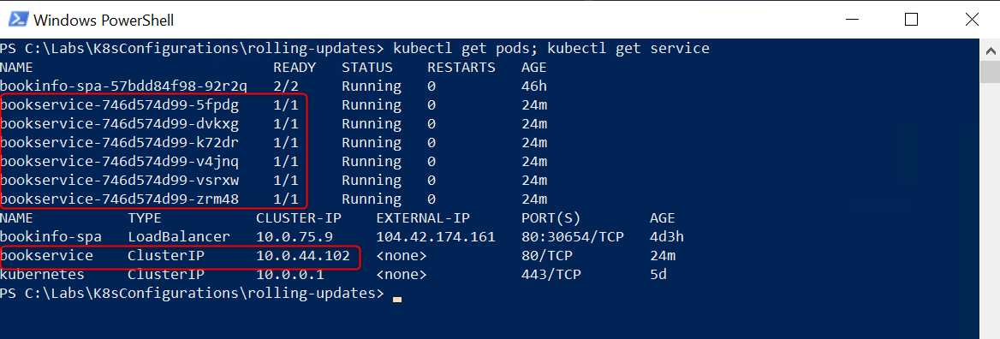
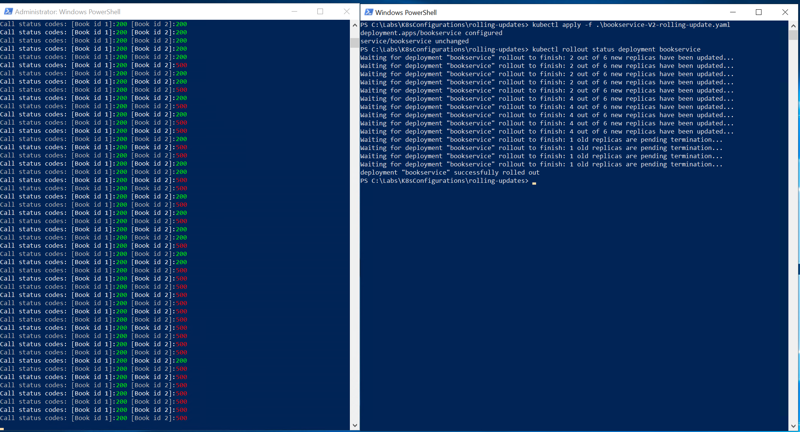
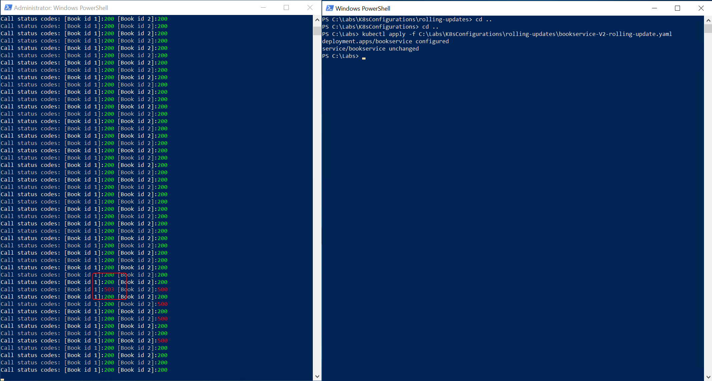
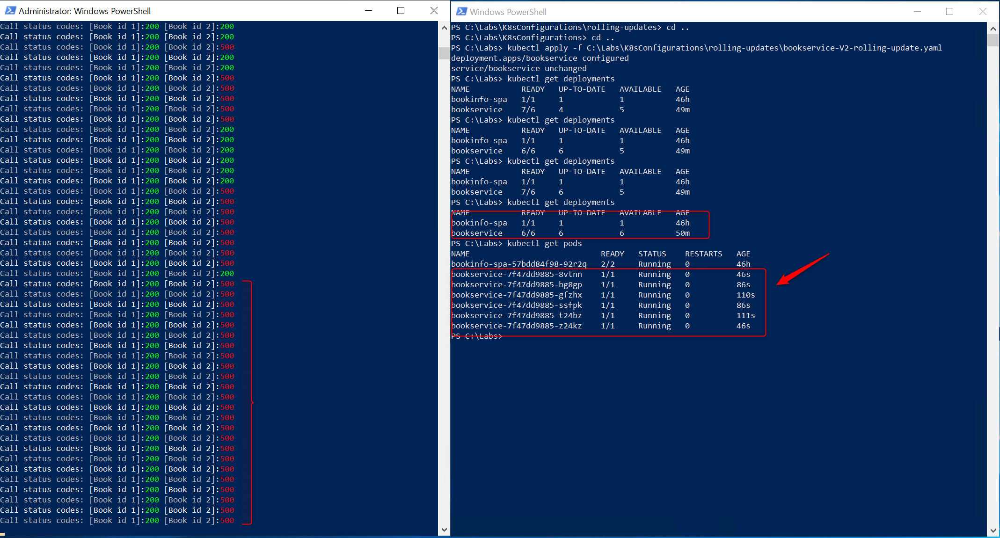
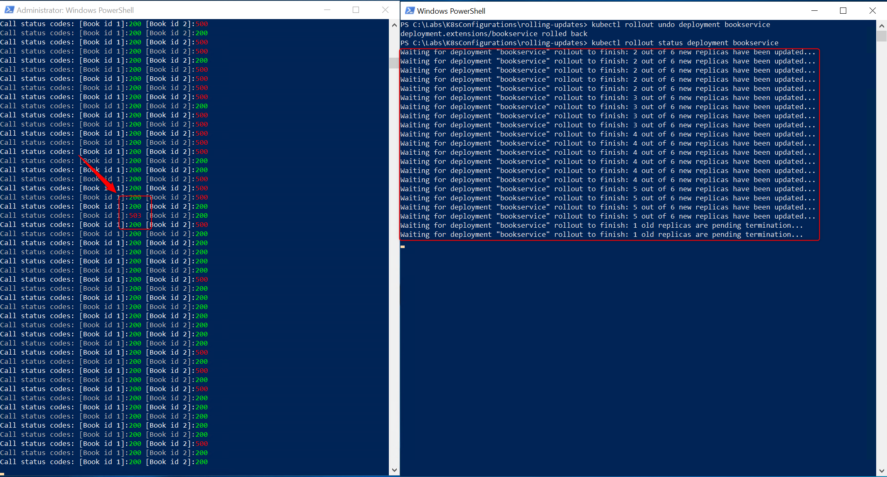

# Rolling Updates deployment

## 1. Clean-up existing BookService deployment

1. Start a PowerShell session and remove existing _bookservice_ deployments and service trought _kubectl_ by executing the following commands:

    ```plain
    kubectl delete deployment bookservice-1.0 bookservice-1.1 ; kubectl delete service bookservice
    ```

    that will return

    ```plain
    deployment.extensions "bookservice-1.0" deleted
    deployment.extensions "bookservice-1.1" deleted
    service "bookservice" deleted
    ```

2. Double check the results of the delete operation by executing:

    ```dos
    kubectl get pod; kubectl get service
    ```

    that confirm the lack of references to the _bookservice_ pods and service

    ```plain
    NAME                            READY   STATUS    RESTARTS   AGE
    bookinfo-spa-57bdd84f98-92r2q   2/2     Running   0          39m
    NAME           TYPE           CLUSTER-IP   EXTERNAL-IP      PORT(S)        AGE
    bookinfo-spa   LoadBalancer   10.0.75.9    104.42.174.161   80:30654/TCP   2d5h
    kubernetes     ClusterIP      10.0.0.1     <none>           443/TCP        3d2h
    ```

## 2. Deploy the BookService API

1. Re-deploy the original BookService API by executing:

    ```dos
    kubectl apply -f C:\Labs\k8sconfigurations\rolling-updates\bookservice-V1-reduntant.yaml
    ```

    that will return an output similar to this:

    ```dos
    deployment.apps/bookservice created
    service/bookservice created
    ```

2. Double check the result of the apply operation by executing:

     ```dos
    kubectl get pods; kubectl get service
    ```

    that will clearly shows the presence of 6 replicas of the BookService and the ClusterIP service as usual

    

## 3. Execute the Poller script

1. Execute the _poller_ script or use the web application to get some traffic for the BookService API. From the folder _C:\Labs\Tools_ runs

    ```powershell
   .\Poller.ps1 -PublicIP $publicIP
    ```

    in order to see how the BookService API correctly returns HTTP 200 for the Book ID 2 reviews

    

## 4. Deploy BookService using Rolling Updates strategy

1. While the _poller_ script is running, open a new PowerShell session and deploy the BookService API using the rolling updates strategy by executing

   ```dos
   kubectl apply -f C:\Labs\K8sConfigurations\rolling-updates\bookservice-V2-rolling-update.yaml
   ```

   that returns

   ```plain
   deployment.apps/bookservice configured
   service/bookservice unchanged
   ```

2. Let's monitor the PowerShell session where _poller_ script is running, you'll start to see some fails for the  [BookId 2] HTTP call

    

     You can use the following command to monitor the rolling out of your deployment:

    ```dos
    kubectl rollout status deployment bookservice
    ```

    that allows you to easily follow the whole operation until all new replicas result updated and the old one terminated

    

    First, let's highlight that that only one just one HTTP 503 has been received using a 1 request per second loop, meaning that that strategy help us to reduce at the maximum level the deployment operation downtime.

    

    then we can see that number of failures will increase as the rolling update strategy upgrades all replicas to the new version

    

    As the screenshots show, you can use

    ```dos
    kubectl rollout status deployment bookservice
    ```

    to monitor the rolling out operation

    ```dos
    kubectl get deployments
    ```

    to monitor the deployment status and

    ```dos
    kubectl get pods
    ```

    to get details about the status of each replica pod, e.g. the age (time passed since the pod has started) and status.

3. You can use Application Insight and Log Analytics to monitor the number of failed request generated by the BookService version deployed using the rolling-updates strategy.

   Wait a couple of minutes, needed for Azure Application Insights to collect telemetry, and paste the content of the "_LogAnalyticsQuery.md_" file into Azure Log Analytics.

    ```plain
    requests
    | where customDimensions["VersionTag"] contains "RU-"
    | summarize duration = avg(duration), requestCount = count() by name, podVersion = tostring(customDimensions["VersionTag"]), resultCode 
    | sort by name, podVersion
    ```

    Then hit "Run" query and you should get something similar to the following image:

      
    _(Please expect few differences in number between your query results and the above image)_

    where the difference between the "**V1-RU-BookService**" and the "**V2-RU-BookService**", in terms of result code counters, are well highlighted

## 5. Apply the rollback

1. Start the undo deployment operation using _kubectl_ by executing:

    ```dos
    kubectl rollout undo deployment bookservice
    ```

2. On the _poller_ script PowerShell session checks the status codes received and, in the meantime, monitor the rollback by executing:

    ```dos
    kubectl rollout status deployment bookservice
    ```

    As you can see on the following screenshot

    

    you may expect to receive a few HTTP 503 (Service Unavailable) response while the roll back is in progress, then after it completes all requests to "BookId 2" will consistently succeed.

    