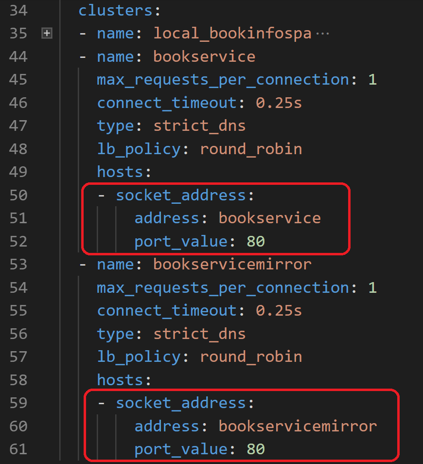

# Lab - Traffic Mirroring

## 1. Clean-up existing BookService deployment

1. Using the PowerShell session alredy used for _kubectl_, remove the existing _bookservice_ deployments and service by executing the following commands:

    ```plain
    kubectl delete deployment bookservice ; kubectl delete service bookservice
    ```

    that will return

    ```plain
    deployment.extensions "bookservice" deleted
    service "bookservice" deleted
    ```

2. Double check the results of the delete operation by executing:

    ```dos
    kubectl get pod; kubectl get service
    ```

    that confirm the lack of references to the _bookservice_ pods and service

    ```plain
    NAME                            READY   STATUS    RESTARTS   AGE
    bookinfo-spa-57bdd84f98-92r2q   2/2     Running   0          39m
    NAME           TYPE           CLUSTER-IP   EXTERNAL-IP      PORT(S)        AGE
    bookinfo-spa   LoadBalancer   10.0.24.21   137.117.168.206  80:31470/TCP   2d5h
    kubernetes     ClusterIP      10.0.0.1     <none>           443/TCP        3d2h
    ```

## 2. Create the mirrored service and deployment

1. Execute the following commands:

    ```powershell
    kubectl apply -f C:\Labs\k8sconfigurations\mirroring\bookservice-V2-mirroring.yaml ; kubectl get services; kubectl get deployments
    ```

   and you should get the following output:  

   

2. At this point both mirrored deployment (bookservicemirror) and user facing deployment (bookservice) are configured with the same docker image (readymirroring/bookservice). Now you can browse the web application or invoke the _poller.ps1_ script used in the previous modules.

   

3. Wait a couple of minutes, needed for Azure Application Insights to collect telemetry, and paste the content of the "_C:\Labs\Lab_Modules\k8sconfigurations\mirroring\LogAnalyticsQuery.md_" file into Azure Log Analytics. 

   ```plain
   requests
   | where customDimensions["VersionTag"] contains "MIR-"
   | summarize duration = avg(duration), requestCount = count() by name, podVersion = tostring(customDimensions   ["VersionTag"]), resultCode 
   | sort by name, podVersion
   ```

   Then hit "Run" query and you should get something similar to the following image:  

     
   _Please expect few differences in number between your query results and the above image_.

4. We are done with our first traffic mirroring! You can see from the query results above that, as we expected, result codes and duration are very close between mirrored and user facing service. 

   In order to achieve that, we tagged traffic coming from user facing service with the attribute "podVersion" = "**V1MIR-LiveBookService**" and the traffic coming from mirrored service with the attribute "podVersion" = "**V2MIR-BookService**".

**How does it work?**

The front end reverse proxy, [Envoy](https://www.envoyproxy.io/), has a very useful configuration that allows to send traffic to a live cluster and a mirror cluster: the traffic is sent to the mirror cluster in a "fire and forget" mode, which means that Envoy doesn't wait for an answer from the mirror cluster.  
You can find the mirror configuration in the file "_C:\Labs\src\Sidecars\default-sidecar.yaml_". Below an excerpt of file:


At line 25 and 26, we configure envoy so that every request to "_bookservice_" cluster must be mirrored to "_bookservicemirror_" cluster.  
Then the configuration of two clusters is straightforward (note how the addresses correspond to the kubernetes services names):



## 3. Introduce a performance decrease in the mirrored service

1. From the same folder, we're going to rollout a new version of our mirrored bookservice, which introduces a delay while loading book reviews by executing the following command:  

   ```powershell
   kubectl apply -f C:\Labs\k8sconfigurations\mirroring\bookservice-V3-delays.yaml
   ```

2. At this point, let's browse again between book reviews from the web page or run the _poller.ps1_ as below:  

   

3. Wait a couple of minutes, needed for Azure Application Insights to collect telemetry, and paste the content of the _C:\Labs\Lab_Modules\k8sconfigurations\mirroring\LogAnalyticsQuery.md_ file into Azure Log Analytics.

   ```plain
   requests
   | where customDimensions["VersionTag"] contains "MIR-"
   | summarize duration = avg(duration), requestCount = count() by name, podVersion = tostring(customDimensions["VersionTag"]), resultCode
   | sort by name, podVersion
   ```

   Then hit "Run" query and you should get something similar to the following image:

   
   _Please expect few differences in number between your query results and the above image_.

We have anticipated our first problem without impacting real users! You can see from Azure Log Analytics query results that the service with "**V3MIR-BookServiceDelay**" tag has an average duration of 1,208 milliseconds, while the "**V1MIR-LiveBookService**" (the version real users are seeing) still has an average requests duration of just 15 milliseconds meaning they are not impacted.

## 3. Introduce a fault in the mirrored service

1. We're going to rollout a new version of our mirrored service, which introduces a fault while loading book reviews with BookId = 2 and BookId = 4 (the same fault we used for previous modules). Type following command:  

   ```powershell
   kubectl apply -f C:\Labs\k8sconfigurations\mirroring\bookservice-V4-fault.yaml
   ```

2. At this point, let's browse again between book reviews from the web page or run the _poller.ps1_ as below:  

   

3. Wait a couple of minutes, needed for Azure Application Insights to collect telemetry, and paste the content of the "_C:\Labs\k8sconfigurations\mirroring\LogAnalyticsQuery.md_" file into Azure Log Analytics.

   ```plain
   requests
   | where customDimensions["VersionTag"] contains "MIR-"
   | summarize duration = avg(duration), requestCount = count() by name, podVersion = tostring(customDimensions["VersionTag"]), resultCode
   | sort by name, podVersion
   ```

   Then hit "Run" query and you should get something similar to the following image:

   
   _Please expect few differences in number between your query results and the above image_.

We have prevented real users from experiencing a failure! You can see from log analytics query results that the service with "**V4MIR-BookServiceFault**" has several requests with a **500** status code, indicating a failure. Meanwhile, the user facing version of the service, "**V1MIR-LiveBookService**", runs smoothly without incurring in any failure.